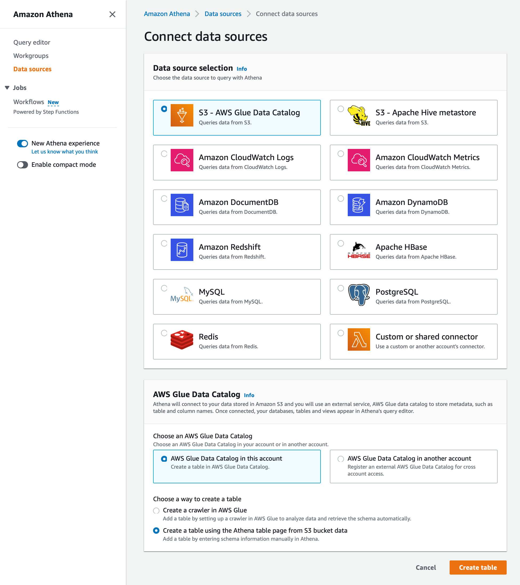
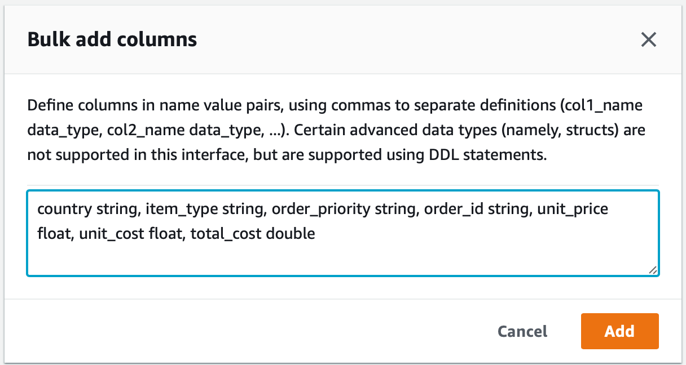
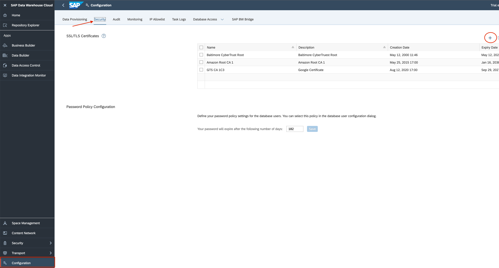
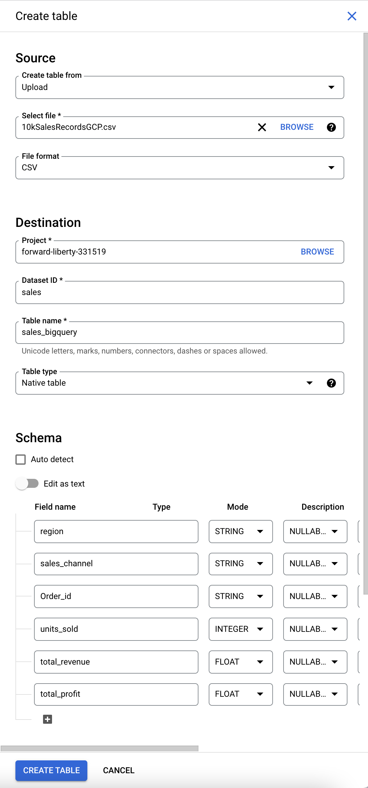
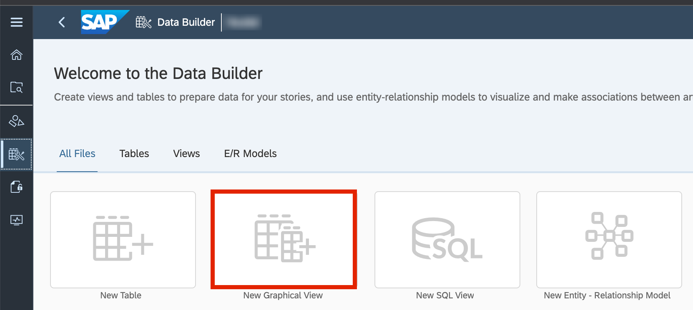
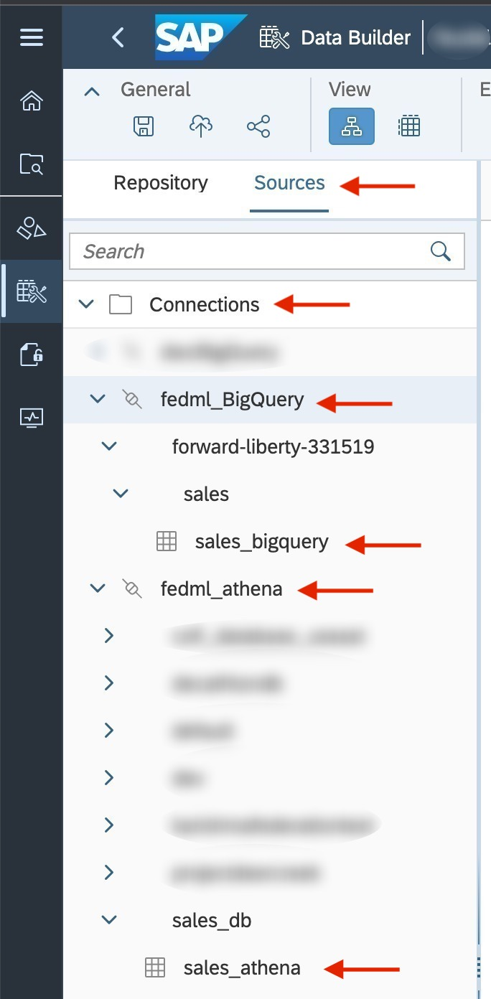
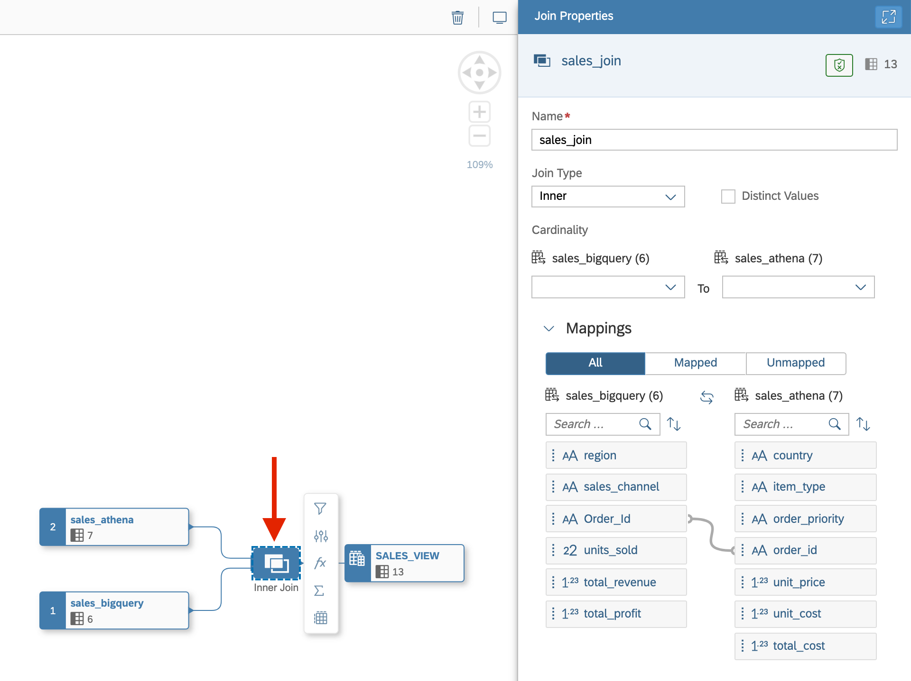
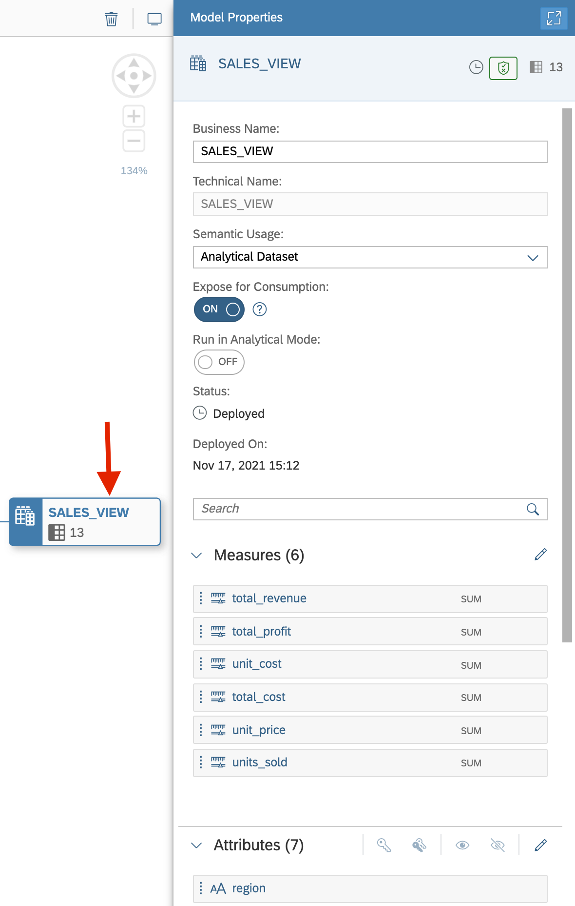
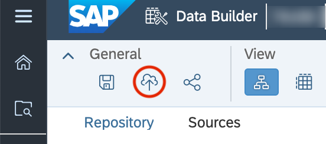
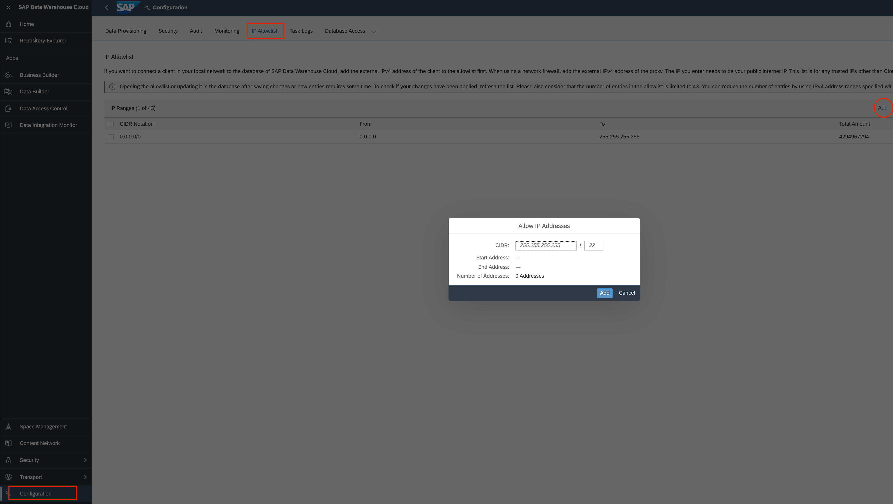

# **Federate data from Amazon Athena and Google BigQuery**

Note:

You can try the trial version of SAP Data Warehouse Cloud ([link](https://www.sap.com/products/data-warehouse-cloud/trial.html)) and Google Cloud ([link](https://cloud.google.com/free/))

## **Federate data from Amazon Athena**

Follow the SAP Discovery Center Mission for Integrating Amazon Athena with SAP DataWarehouse Cloud ([link](https://discovery-center.cloud.sap/missiondetail/3401/3441/)). 

Refer the following steps when completing the Discovery Center mission:

1.	The sample dataset to be uploaded to s3 bucket in step 3 of “Make Sure Prerequisites are Fulfilled and All Required Systems are in Place” card can be found [here](../Linear-Regression/datasets/10kSalesRecordsAthena.csv).

2.  After step 2 of "Configure Amazon Athena in AWS" card , complete step 5 of "Configure Amazon Athena in AWS" card and then proceed to step 3.

3.	In step 3 of “Configure Amazon Athena in AWS” card, Open Data sources in the Athena dashboard, Click Connect data source.

    In the Connect data sources page, Select ‘s3 - AWS Glue Data Catalog Queries data from s3’ option for ‘Data Source selection’, select ‘AWS Glue Data Catalog in this account’ option for ‘Choose an AWS Glue Data Catalog’, select ‘Create a table using the Athena table page from s3 bucket data’ option for ‘Choose a way to create a table’ and click on Create table. Continue with the creation of table in the step 3 of “Configure Amazon Athena in AWS”.

    

4.	Add the following columns in the “Bulk add columns” section in step 4 of “Configure Amazon Athena in AWS” card and skip to step 6 of “Configure Amazon Athena in AWS” card:

    

5.	In step 2 of “Configure SAP Data Warehouse Cloud to Federate Data” card, Click on Configuration in SAP Data Warehouse Cloud dashboard, click on Security and add the certificates for S3 and AWS from step 6 of “Configure Amazon Athena in AWS” card in .pem format.

    

6.	Complete all the steps till step 4 of the “Configure SAP DataWarehouse Cloud to Federate Data” card. The connection between Amazon Athena and SAP DataWarehouse Cloud is established.

## **Federate data from Google BigQuery**

Follow the SAP Discovery Center Mission for Integrating Google BigQuery with SAP DataWarehouse Cloud ([link](https://discovery-center.cloud.sap/missiondetail/3409/3449/)). 

Refer the following steps when completing the Discovery Center Mission:

1.	Create a new BigQuery table in step 2 of the “Configure BigQuery” card by uploading the sample dataset ([link](../Linear-Regression/datasets/10kSalesRecordsGCP.csv)), adding the schema columns as follows and skip to step 4 of “Configure BigQuery” card:

    

2.	In step 1 of the “Configure SAP Data Warehouse Cloud to Federate Data” card, Click on Configuration in SAP Data Warehouse Cloud dashboard, click on Security and upload the certificate.

    

3.  Complete all steps till step 4 of the “Configure SAP Data Warehouse Cloud to Federate Data” card. The connection between Google BigQuery and SAP DataWarehouse Cloud is established.

## **Create Remote table in SAP Data Warehouse Cloud**

1.  Open SAP Data Warehouse Cloud dashboard, Go to Data Builder and click New Graphical view

    

    Select sources and Open Connections, Google BigQuery Connection, Project, Dataset and select the BigQuery table. Drag the BigQuery table to the SQL editor.

    

    Similarly, Open Connections, Athena Connection, Database and select the Athena table. Drag the Athena table over the BigQuery table on the SQL Editor and select the join operation. Click the inner join icon and observe the relevant column mapped in the join properties.

    

2.  Click on the view, Enter the Business Name, Technical name, select "Analytical Dataset" in the semantic usage and turn on "Expose for Consumption", add the desired measures by dragging the desired columns from Attributes section to Measures section. 

    

    Save and deploy the Analytical Dataset.

    

    Note: Ensure that SAP Data Warehouse Cloud can be accessed from Azure by allowing the trusted IP addresses. Go to Configuration in the SAP Data Warehouse Cloud dashboard, click on IP Allowlist, click on Add and add the IP address(es).

    

