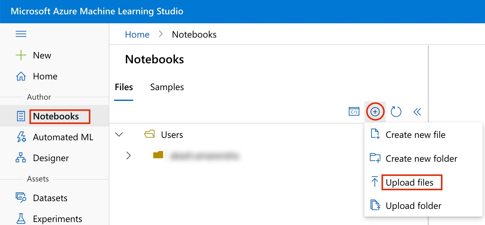
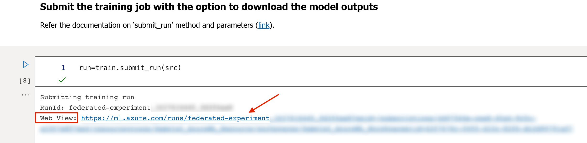
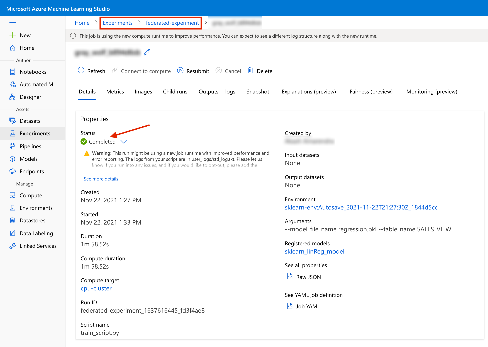
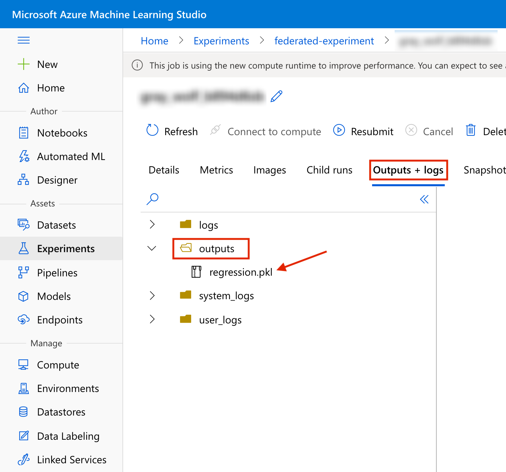

# **Steps to build a Machine Learning Model on Azure using Federated ML Library for Azure ML**

1.	Download the Federated ML Library for Azure ML:

    Download the library using the [link](https://github.com/SAP-samples/data-warehouse-cloud-fedml/blob/main/Azure/fedml_azure-1.0.0-py3-none-any.whl). It will be downloaded in a .whl file format on your local system.

2.  Upload the library file to the AzureML Studio:

    Open AzureML Studio ([link](https://ml.azure.com/)), Click on Notebooks, Click the + icon, select Upload files and upload the library file.

    

3.  Create a training folder in the AzureML Notebooks section by referring the training folder 'Linear-Regression/Scikit-Learn-Linear-Regression' ([link](../Linear-Regression/Scikit-Learn-Linear-Regression)) created to hold the scripts and files for training.

    Create a training script inside the training folder by referring the training script 'train_script.py' ([link](../Linear-Regression/Scikit-Learn-Linear-Regression/train_script.py)) created under 'Scikit-Learn-Linear-Regression' folder for building a ML model.

    Refer step 4 of the "Pre-requisites for the Federated ML Library for Azure ML" ([link](prerequisites.md)) for creation of new folder and new file in AzureML Studio.

3.  In the newly created notebook, follow the steps of the LinearRegression.ipynb notebook ([link](../Linear-Regression/LinearRegression.ipynb)) to build a Linear Regression Model on Azure by federating the training data from Amazon Athena and Google BigQuery via SAP Data Warehouse Cloud.

4.  Test the successful completion of the experiment as follows:

    In the notebook, click on the 'Web View' url visible after running the "Submit the training job with the option to download the model outputs" cell as follows. This takes you to the Experiments Run page:

    

    Alternatively, Click on the Experiments in the AzureML Studio dashboard, Click on the desired Experiment and select the latest run for the experiment.
    
    In the Experiments Run page, confirm the status of the run as "Completed" as seen below:

    

    In the same page, click on the 'Outputs + logs' and check for the .pkl model file created under the outputs folder.

    

Congratulations! You have build a Machine Learning Model in Azure by federating the training data via SAP Data Warehouse Cloud using the FedML library for AzureML, without replicating the data from the original data storages.

