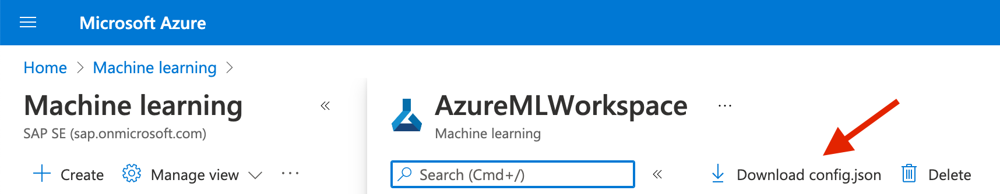
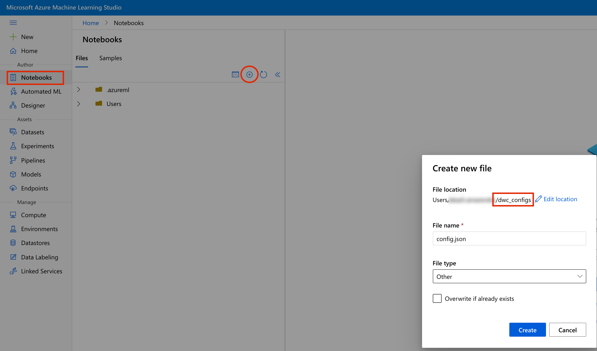
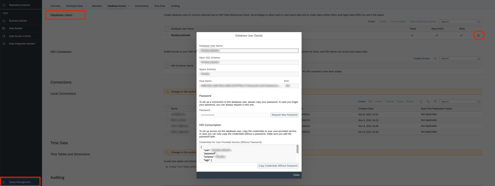

# **Pre-requisites for the Federated ML Library for Azure ML**

1.	Create a new [Azure subscription](https://azure.microsoft.com/en-us/free/?v=a&adobe_mc_sdid=SDID%3D17B51AC3059EF846-1FAC2DD18C4371FA%7CMCORGID%3DEA76ADE95776D2EC7F000101%40AdobeOrg%7CTS%3D1634155040) or access existing subscription information from the [Azure portal](https://portal.azure.com/).

2.	Create an AzureML workspace by referring the [guide](https://docs.microsoft.com/en-us/azure/machine-learning/how-to-manage-workspace?tabs=azure-portal#create-a-workspace) . Once the workspace is created, download the ‘config.json’ file as shown below and take a note of its configurations:

    

3.  Create AzureML Notebook and compute by referring this [guide](https://docs.microsoft.com/en-us/azure/machine-learning/tutorial-power-bi-custom-model#create-a-notebook-and-compute).

4.  Create a file named 'config.json' in the AzureML Notebooks section to connect to SAP Data Warehouse Cloud.

    Open AzureML Studio ([link](https://ml.azure.com/)), Click on Notebooks, Click the + icon, select Create new folder and create a folder with the name 'dwc_configs'. Similarly, Click the + icon, select Create new file, change the file location to 'dwc_configs' folder and create a new file with the name 'config.json'.

    

    Copy the contents of the template config.json file ([link](../Linear-Regression/dwc_configs/config.json)) into the newly created ‘config.json’ in the AzureML Notebooks section.

    Note: Create a Database user in SAP Data Warehouse Cloud, if not already created by referring the [guide](https://help.sap.com/viewer/9f804b8efa8043539289f42f372c4862/cloud/en-US/798e3fd6707940c3bd2219b2d1ebaac2.html). 

    Open SAP Data Warehouse Cloud dashboard, Click on Space Management, Open the desired Space, Click on Database Access, go to the desired Database User and open Database User Details by clicking on the info icon as shown below. 
    
    Replace the values for the fields in the newly created ‘config.json’ with those of Database User details. 

    More information on the database user details can be found in the step 4 of this [guide](https://help.sap.com/viewer/9f804b8efa8043539289f42f372c4862/cloud/en-US/798e3fd6707940c3bd2219b2d1ebaac2.html)

    

