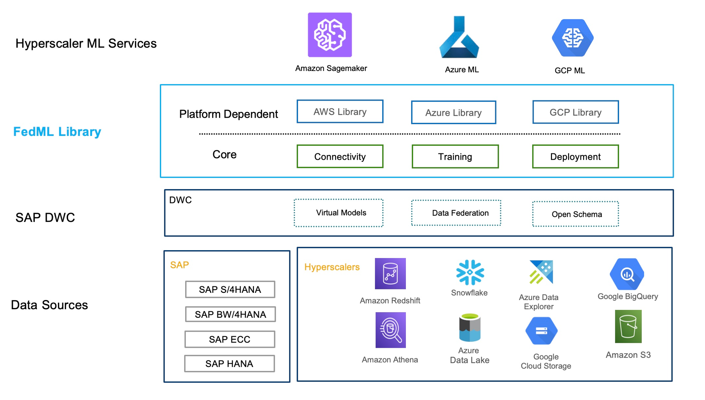

# **Federated Machine Learning using SAP Data Warehouse Cloud and Azure Machine Learning**

The Federated-ML or FedML library applies the data federation architecture with SAP Data Warehouse Cloud for intelligently sourcing the data in real-time from data storages. The library provides functionality that enables businesses and data scientists to build, train and deploy machine learning models on hyperscalers, without the hassle of replicating or migrating the data from the original data storage. The library also provides the capabilities to build machine learning models by sourcing the data stored across multiple data storages in real-time.

By abstracting the data connection, data load and model training on these hyperscalers, the FedML library provides end to end integration with just a few lines of code.

In this example, we focus on building a machine learning model on Azure by federating the training data from Amazon Athena and Google BigQuery via SAP Data Warehouse Cloud without the need for replicating or moving the data from the original data storages.

## The overview of the sections involved are as follows:

### Step 1: [Federate data from Amazon Athena and Google BigQuery.](docs/data_federation.md)

### Step 2: [Pre-requisites for the Federated ML Library for Azure ML.](docs/prerequisites.md)

### Step 3: [Steps to build a machine learning model on Azure using Federated ML library for Azure ML.](docs/model_build_steps.md)

