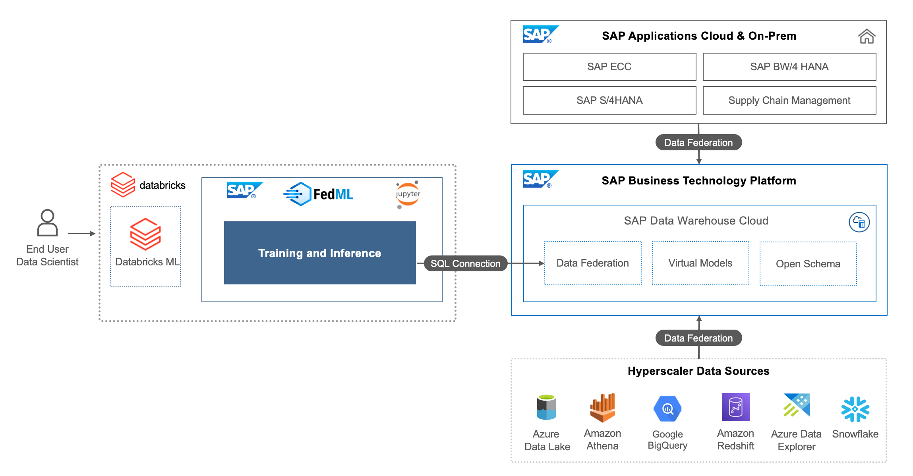

# **FedML Library for Databricks & SAP Integration** 

## **Description**

The SAP Federated ML Python library for Databricks applies the Data Federation architecture of SAP Data Warehouse Cloud for intelligently sourcing SAP as well as non-SAP data for Machine Learning experiments done in Databricks, thereby removing the need for replicating or moving the data. By abstracting the Data Connection, Data load, Model Deployment in SAP environment, and Inferencing for Machine learning processes , the FedML Databricks library provides end to end integration with few lines of code.

## **Solution Architecture** 

## **Documentation**

For documentation on SAP Data Warehouse Cloud Core Connectivity methods, please refer [(DbConnection)](docs/dbconnection.md)  
For documentation on FedML Databricks SAP Kyma Kubernetes deployment and inferencing methods, please refer [(FedML Databricks Deployment/Inferencing)](docs/fedml_databricks.md)  

For getting started with the FedML Databricks Library, please refer the sample notebooks [(Sample notebooks)](./sample-notebooks)

