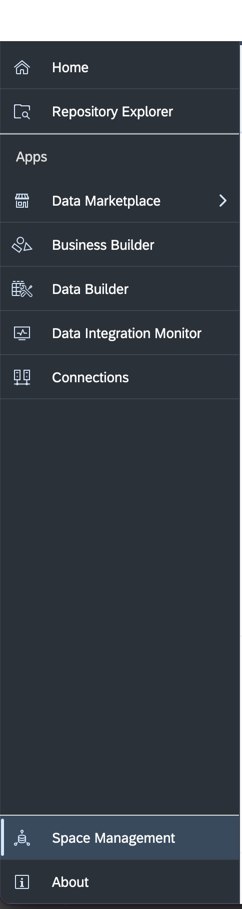
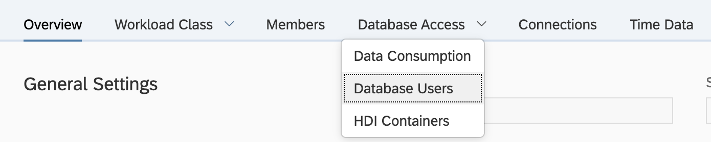
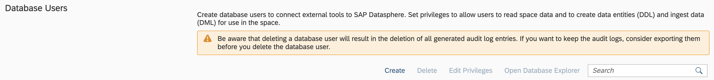

# **DbConnection class**

DbConnection class abstracts the connectivity to SAP Datasphere, data query, data fetch and data load thereby reducing complexity and efficiently sourcing the data for the Hyperscaler Machine Learning environments with just couple lines of code.

## Pre-requisite:

SAP Datasphere config stored in a secure manner in the form of Databricks Secret. <BR>

**<u>SAP Datasphere config</u>**  
```
{

    "address":  <The IP address or host name of the database instance. Required. String>,
    "port": <The port number of the database instance. Required>,
    "user": <The database user. Required>,
    "password": <The database user's password. Required>,
    "schema": <The SAP Datasphere Space Schema. Optional>,
    "encrypt": <"true" . Denotes an encrypted connection>,
    "sslValidateCertificate": <"false" . Specifies whether to validate the server's certificate>,
    "disableCloudRedirect": < "true". Specifies if there should be a tenant redirection for a cloud instance),
    "communicationTimeout": <"0". Value of 0 Disables any communicaiton Timeouts>,
    "autocommit": <"true". Sets auto commit to true for the database connection>,
    "sslUseDefaultTrustStore": <"true". Denotes the use of client's default trust store>
}  
```
<br>

**Setting up your SAP Datasphere config**  

1. Navigate to the space management inside SAP Datasphere 
<br>

<br>
2. Navigate to database users.


<br>
3. Create a user if you don't already have one with Read and Write privileges.


<br>
4. Click on the i icon.


Here you will find the following information for your SAP Datasphere config: <br>
- Database User Name --> `user`
- Space Schema --> `schema`
- Host Name --> `address`
- Port --> `port`
- Password --> `password`
<br>

5. Store the SAP Datasphere config in the form of Databricks secret. Use the SAP Datasphere config stored as a Databricks secret in the notebook to connect to SAP Datasphere.

## Constructor
 
**DBConnection(`'url=None'`, `'dict_obj=None'`)**<br>
Parameters: <br>
`'url':` ([str](https://docs.python.org/3/library/stdtypes.html#str)): The url path of where to find the SAP Datasphere config file (config.json)<br>
`'dict_obj':` ([str](https://docs.python.org/3/library/stdtypes.html#str)): The SAP Datasphere config in the form of a dictionary object.<br>
Examples: <br>
`db = DbConnection(url='/dbfs/FileStore/config.json')`<br>
`db = DbConnection(dict_obj=config_object)`


## Class Methods

1. **get_schema_views()**:<br>
Returns the list of all view names in the space schema. <br>
Parameters:<br>
None<br>
Example: <br>
`db.get_schema_views()`
<br> <br>

2. **get_table_size(`'table_name'`)**:<br> 
Returns the count of rows in the existing schema object <br>
Parameter: <br>
`'table_name'` [(str](https://docs.python.org/3/library/stdtypes.html#str)): The name of the table.<br>
Example: <br>
`db.get_table_size('TITANIC_VIEW')`
<br> <br>

3. **get_user_tables()**:<br>
Returns the list of all the tables in the user schema.  <br>
Parameters:<br>
None<br>
Example: <br>
`db.get_user_tables()`
<br> <br>

4. **get_data_with_headers(`'table_name'`,`'size=1'`)**: <br>
Returns the data fetched from schema view as a list <list of rows, list of column headers>. <br>
Parameters: <br> 
`'table_name'` ([str](https://docs.python.org/3/library/stdtypes.html#str)): The name of the table.<br>
`'size'` ([float](https://docs.python.org/3/library/functions.html#float)): Number of rows to fetch from the schema view. For example, size=1 fetches all the rows of the view, size=0.2 fetches 20% of the rows in the view.<br>
Example:<br>
`db.get_data_with_headers(table_name='IRIS_VIEW', size=1)`
<br> <br>

5. **get_data_with_headers_pyspark(`'table_name'`,`'size=1'`)**: <br>
Returns the data fetched from schema view as a PySpark DataFrame. <br>
Parameters: <br> 
`'table_name'` ([str](https://docs.python.org/3/library/stdtypes.html#str)): The name of the table.<br>
`'size'`  ([float](https://docs.python.org/3/library/functions.html#float)): Number of rows to fetch from the schema view. For example, size=1 fetches all the rows of the view, size=0.2 fetches 20% of the rows in the view.<br>
Example:<br>
`db.get_data_with_headers_pyspark(table_name='IRIS_VIEW', size=1)`
<br> <br>

6. **get_view_metadata(`'view_name'`)**: <br> 
Returns the metadata of the view. <br>
Parameter: <br> 
`'view_name'`  ([str](https://docs.python.org/3/library/stdtypes.html#str)): The view name. <br>
Example:<br>
`db.get_view_metadata('test_view')`
<br><br>

7. **get_table_metadata(`'table_name'`)**: <br> 
Returns the metadata of the table. <br>
Parameter: <br> 
`'table_name'`  ([str](https://docs.python.org/3/library/stdtypes.html#str)): The table name. <br>
Example:<br>
`db.get_table_metadata('test_table')`
<br><br>

8. **get_view_by_name(`'view_name'`)**: <br> 
Searches for views with name similar to the parameter `'view_name'` and returns it. <br>
Parameter: <br> 
`'view_name'`  ([str](https://docs.python.org/3/library/stdtypes.html#str)): The view name. <br>
Example:<br>
`db.get_view_by_name('test_view')`
<br><br>

9. **execute_query(`'query'`)**: <br> 
Executes the SQL Query and returns the data fetched as a list <list of rows, list of column headers>. <br>
Parameter: <br> 
`'query'`  ([str](https://docs.python.org/3/library/stdtypes.html#str)): The SQL query to execute<br>
Example:<br>
`db.execute_query('SELECT * FROM \"FEDMLTEST\".\"iris_view\"')`
<br><br>

10. **execute_query_pyspark(`'query'`)**: <br> 
Executes the SQL Query and returns the data fetched as a PySpark DataFrame. <br>
Parameter: <br> 
`'query'`  ([str](https://docs.python.org/3/library/stdtypes.html#str)): The SQL query to execute<br>
Example:<br>
`db.execute_query_pyspark('SELECT * FROM \"FEDMLTEST\".\"iris_view\"')`

11. **create_table(`'query'`)**: <br> 
Creates a table in SAP Datasphere. <br>
Please note this function will create a default column called `INSERTED_AT` in the table specified. This column will keep track of the timestamp at which you inserted data into the table for the first time.<br>
Parameter: <br> 
`'query'`  ([str](https://docs.python.org/3/library/stdtypes.html#str)): The SQL query to create a table.<br>
Example:<br>
`db.create_table("CREATE TABLE T6 (ID INTEGER PRIMARY KEY, C2 VARCHAR(255))")`
<br><br>

12. **drop_table(`'table_name'`)**: <br> 
Drops table specified. <br>
Please note this function only deletes the DB Users table. If this table was deployed in SAP Datasphere and/or has a view attached, you will need to delete those manually in SAP Datasphere. <br>
Parameter: <br> 
`'table_name'`  ([str](https://docs.python.org/3/library/stdtypes.html#str)): The table name. <br>
Example:<br>
`db.drop_table('T6')`
<br><br>

13. **alter_table(`'table_name','clause'`)**: <br> 
Alters the table in user schema. <br>
Parameter: <br> 
`'table_name'`  ([str](https://docs.python.org/3/library/stdtypes.html#str)): The table name. <br>
`'clause'`  ([str](https://docs.python.org/3/library/stdtypes.html#str)): The condition for alter. <br>
Example:<br>
`db.alter_table('test_table','ADD (COL1 VARCHAR(20))')`
<br><br>

14. **insert_into_table(`'table_name'`, `'table_values'`)**: <br> 
Inserts data into the table specified. <br>
Please note this function will insert the current timestamp into a column called `INSERTED_AT` in the table specified. <br>
Parameter: <br> 
`'table_name'`  ([str](https://docs.python.org/3/library/stdtypes.html#str)): The table name. <br>
`'table_values'`  ([Pandas DataFrame](https://pandas.pydata.org/docs/reference/frame.html)): The data to insert.<br>
Example:<br>
`sample_df = pd.DataFrame([[6,'hey6'],[7,'bye7']], columns=['id', 'c2'])`<br>
`db.insert_into_table('T6', sample_df)`
<br><br>

15. **delete_from_table(`'table_name'`,`'where_clause=None'`)**: <br> 
Deletes the selected rows from the table. <br>
Note: Deletes all the rows if `'where_clause'` is not specified. <br>
Parameter: <br> 
`'table_name'`  ([str](https://docs.python.org/3/library/stdtypes.html#str)): The table name. <br>
`'where_clause'`  ([str](https://docs.python.org/3/library/stdtypes.html#str)): The where condition for delete. <br>
Example:<br>
`db.delete_from_table('test_table','col_a=10')`
<br><br>


16. **update_table(`'table_name','set_clause','where_clause=None'`)**: <br> 
Updates the selected rows in the table. <br>
Note: Updates all the rows if `'where_clause'` is not specified. <br>
Parameter: <br> 
`'table_name'`  ([str](https://docs.python.org/3/library/stdtypes.html#str)): The table name. <br>
`'set_clause'`  ([str](https://docs.python.org/3/library/stdtypes.html#str)): The set condition for update. <br>
`'where_clause'`  ([str](https://docs.python.org/3/library/stdtypes.html#str)): The where condition for update. <br>
Example:<br>
`db.update_table('test_table','col_a=10','col_b=20')`
<br><br>


