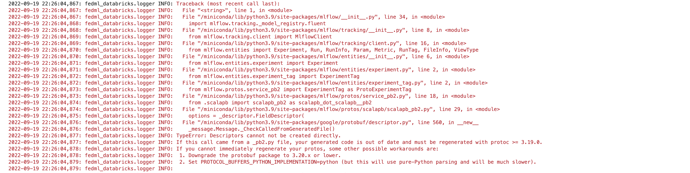

# **Deployment and Inferencing methods**

[deploy_to_kyma](#deploy_to_kyma)  
Method to deploy a MLflow Databricks model to SAP Kyma Kubernetes.

[predict](#predict)  
Method to perform inferencing on the deployed SAP Kyma Kubernetes endpoint.


## **deploy_to_kyma**    
Method to deploy a MLflow Databricks model to SAP Kyma Kubernetes.  

`deploy_to_kyma(databricks_config_path)` 

### **Pre-requisites**

#### Infrastructure Requirement:

  - Use any linux environment.
  - Python version compatible with latest version of mlflow. The compatible python version can be found [here](https://pypi.org/project/mlflow/)
  - A running docker daemon.

#### Create a Kyma service account and create a kubeconfig.yaml file to connect to Kyma Kubernetes

  - Create a Kyma service account by referring the [(tutorial)](https://developers.sap.com/tutorials/kyma-create-service-account.html#55c9eee0-eaee-4005-a6a3-4b72f83fe186).    

  - In step 2.1 of the [(tutorial)](https://developers.sap.com/tutorials/kyma-create-service-account.html#55c9eee0-eaee-4005-a6a3-4b72f83fe186), add the following fields:    

    - Add 'namespaces' under 'rules -> resources' section of yaml file.  
    - Add 'watch' under 'rules -> verbs' section of yaml file.  

  - In step 4.1 of the [(tutorial)](https://developers.sap.com/tutorials/kyma-create-service-account.html#55c9eee0-eaee-4005-a6a3-4b72f83fe186), replace the following:  

    - Replace the value of 'name' under 'clusters' section with the cluster name of the kyma kubernetes cluster.
    - Replace the value of 'name' under 'users' section and 'user' under 'contexts'-> 'context' with 'OIDCUser' user.
    - Replace the value of 'name', 'context -> cluster' under 'contexts' section with the cluster name of the kyma kubernetes cluster.
    - Replace the value of 'current-context' with the cluster name of the kyma kubernetes cluster.

  -  The 'kubeconfig.yaml' file is generated to connect to Kyma Kubernetes.

#### **Pre-requisite steps for Databricks**

- Generate a Databricks personal access token in the Databricks Workspace by referring the [link](https://docs.databricks.com/dev-tools/api/latest/authentication.html#generate-a-personal-access-token). 

#### **Pre-requisite steps for SAP Kyma Kubernetes Deploy using Azure Container Registry**  

- Ensure that the Azure Container Registry is created either by creating a Azure ML Workspace [(link)](https://docs.microsoft.com/en-us/azure/machine-learning/how-to-manage-workspace?tabs=azure-portal#create-a-workspace) or via the Azure portal [(link)](https://docs.microsoft.com/en-us/azure/container-registry/container-registry-get-started-portal?tabs=azure-cli). Also, take a note of the login server in the overview page of the created Azure Container Registry.

- Create a Service Principal and assign 'AcrPush' role to the Service Principal in the Azure Container Registry.

  - Register an application with Azure AD and create a service principal using the [(link)](https://docs.microsoft.com/en-us/azure/active-directory/develop/howto-create-service-principal-portal#register-an-application-with-azure-ad-and-create-a-service-principal)  

  - Get the Application (client) ID by referring [(get application id)](https://docs.microsoft.com/en-us/azure/active-directory/develop/howto-create-service-principal-portal#get-tenant-and-app-id-values-for-signing-in). The Application (client) ID is the "SERVICE_PRINCIPAL_ID".

  - Create a new application secret by referring [(create new application secret)](https://docs.microsoft.com/en-us/azure/active-directory/develop/howto-create-service-principal-portal#option-2-create-a-new-application-secret). The value of the client secret displayed is the "SERVICE_PRINCIPAL_PASSWORD".  

  - Assign 'AcrPush' role to the created Service Principal in the Azure Container Registry using the Azure CLI [(link)](https://docs.microsoft.com/en-us/azure/container-registry/container-registry-auth-service-principal#use-an-existing-service-principal) or Azure Portal [(link)](https://docs.microsoft.com/en-us/azure/role-based-access-control/role-assignments-portal?tabs=current).

#### **Pre-requisite steps for SAP Kyma Kubernetes Deploy using AWS Elastic Container Registry**

- You must have an IAM user that does not have MFA enabled and has EC2 container registry access permissions for pushing and pulling to ecr. [(link)](https://docs.aws.amazon.com/AmazonECR/latest/userguide/registry_auth.html)

- You must also create a profile using aws cli that connects to the IAM user with EC2 container registry access permissions. Please ensure the region of this profile is the same region as the jupyter instance.[(link)](https://docs.aws.amazon.com/cli/latest/reference/configure/index.html)


### **Parameters**:

`databricks_config_path` [(str)](https://docs.python.org/3/library/stdtypes.html#str):
  The file path of the Databricks configuration json file.

The Databricks configuration json file must contain the following configurations.

**<u>Databricks configuration json</u>**  
```
{
    "DATABRICKS_URL":<Databricks Workspace Url>,
    "DATABRICKS_ACCESS_TOKEN":<Databricks Personal Access Token created in the Pre-requisite section>,
    "MODEL_URI":<URI of the Databricks MLflow model to deploy in the form of "runs:/{run_id}/{model_name}>,
    "CONTAINER_REGISTRY_TYPE":<Type of container registry to use. The supported container registry types are 'ACR' for Azure Container Registry and 'ECR' for AWS Elastic Container Registry>,
    "SERVICE_NAME":<Name of the service or deployment>,
    "KUBECONFIG_PATH":<File path to the kubeconfig.yaml file created in the Pre-requisite section>,
    "OVERWRITE_SERVICE":<Optional. Overwrites the existing deployment if set to true.>
```
<u>Azure ACR Specifc Configurations</u> 
```
    "SERVICE_PRINCIPAL_ID":<Service Principal ID created in the Pre-requisite section>,
    "SERVICE_PRINCIPAL_PASSWORD":<Service Principal Password created in the Pre-requisite section>,
    "ACR":<Azure Container registry login server in the form of "<mycontainerregistry>.azurecr.io">,
```
<u>AWS ECR Specifc Configurations</u> 
```
    "PROFILE_NAME":<Name of the profile created in the Pre-requisite section>
}
```
<br>

### **Returns**

SAP Kyma Kubernetes Endpoint.

### **Return Type**

[(str)](https://docs.python.org/3/library/stdtypes.html#str)

### **Remarks**
Example:

```
from fedml_databricks import deploy_to_kyma
endpoint_url=deploy_to_kyma(databricks_config_path='<path-to-databricks-config-json-file>')
```

### **Troubleshooting Kyma Deployment** 

- If you get an error similar to the below image during deployment, please ensure that you have a python version compatible with the latest version of mlflow which can be found [here](https://pypi.org/project/mlflow/) and install the latest version of mlflow.



## **predict**  
Method to perform inferencing on the deployed SAP Kyma Kubernetes endpoint.

`predict(endpoint_url,data)`

### **Parameters**  :

`endpoint_url` [(str)](https://docs.python.org/3/library/stdtypes.html#str):   
 The endpoint url of the SAP Kyma Kubernetes deployment.  

`data` (Serialized json object):      
The data used for inferencing. 

### **Returns**

The result of inferencing.

### **Remarks**  

Example: Inferencing the SAP Kyma Kubernetes webservice endpoint 
```
data = json.dumps({
    'data': <pandas-dataframe-containing-inferencing-data>.values.tolist()
})

#Predict using the endpoint_url

from fedml_databricks import predict
predict(endpoint_url=<kyma-endpoint-url>,data=data)


