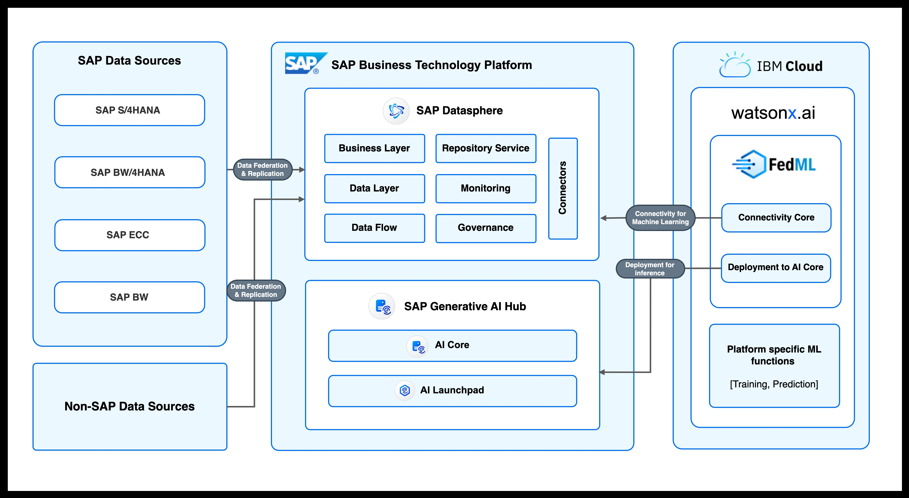

# **Description**

The SAP Federated ML Python libraries (FedML) applies the Data Federation architecture of SAP Datasphere to intelligently source SAP and non-SAP data for ML experiments done on any machine learning platform, thus removing the need for data replication and migration. By abstracting the data connection, data load, and model training, model deployment, and inferencing for machine learning flows, the FedML library provides end to end integration with few lines of code. The library also offers flexibility for user provided training scripts during model training.

# **Solution Architecture**



# **Prerequisites** 

The following steps needs to be completed in order to access the library functionality on IBM:

- IBM Cloud Subscription
In order to create an IBM Watson Studio Workspace, first you need access to an IBM Cloud. You can start with a [free tier account](https://www.ibm.com/cloud/free) and then continue on a [paid plan](https://www.ibm.com/cloud/pricing).

- IBM Watson Studio workspace
Create a workspace from IBM Watson Studio. For more details on creating a project, please refer to the following [documentation page](https://www.ibm.com/docs/en/db2-event-store/2.0.0?topic=data-projects).

# **Installation**

To install the SAP FedML DSP library, use the following pip command:

```
pip install fedml-dsp
```

# **Documentation**

- [DbConnection Docs](../dbconnection.md)
- [FedML DSP Library Docs](../fedml-dsp.md).  
- [Sample Notebooks](./sample-notebooks/).

# **GPU Usage**

In order for the `fedml-dsp` library to work on a GPU IBM instance, some changes to the pre-existing environment must be made. `PyArrow` and the existing `watson-nlp` library must be removed. The latter must depends on the pre-existing `PyArrow` version and causes issues during the RAPIDs installation required by our library, if it is still present.

To remove the conflicting packages:

```
!pip uninstall watson-nlp -y
!pip uninstall pyarrow -y
```

**Running this as the first cell** in the notebook is strongly recommended!
