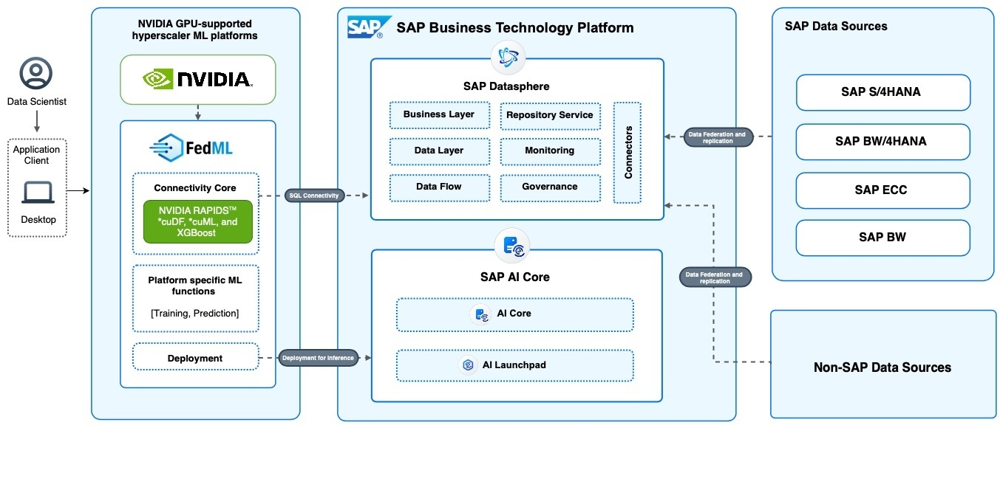

# FedML [with support for NVIDIA GPUs]

## Description 
 
 
FedML can now be used in notebooks with GPU computes. FedML now has support for NVIDIA RAPIDS™ and CUDA cuDF and cuML and automatic detection of GPU for adding support for RAPIDS™ CUDA. FedML's Connectivity component supports reading data from semantic models of SAP Datasphere directly into CUDA cuDF dataframes. FedML's GPU support helps data scientists accelerate the machine learning workflows with NVIDIA GPUs, while providing instant access to SAP's critical business data without the need for ETL or additional overhead in processing ETL'd data.

## Solution Architecture

## Installation

Install the SAP FedML DSP library using pip as follows:

`pip install fedml-dsp`

## Documentation and getting started

For getting started with the SAP FedML DSP Library and for documentation and sample notebooks, please refer the SAP FedML DSP documentation [here](fedml-dsp.md), the DbConnection documentation [here](../dbconnection.md), and sample notebook [here](./sample-notebooks/).
