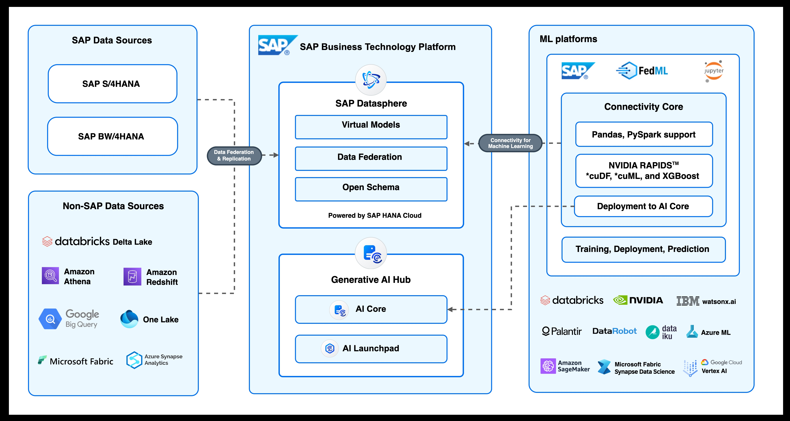

# **Description**

The SAP Federated ML Python libraries (FedML) applies the Data Federation architecture of SAP Datasphere for intelligently sourcing SAP as well as non-SAP data for Machine Learning experiments done <b>at any Machine Learning platform</b> thereby removing the need for replicating or moving data. By abstracting the Data Connection and  Data load , the FedML library provides end to end platform agnostic integration support for instant data access & discovery of semantically rich business data with just few lines of code. 

# **What's new**

<ul>
  <li>Platform Independency -  FedML can be used on any (non-hyperscaler) Machine learning platform.
  <li>GPU support  - We now support NVIDIA RAPIDS™ framework and CUDA cuDF and cuML.
  <li>SAP AI Core Deployment Support  - Models that are trained in any ML Platform can now be deployed in SAP GenAI Hub's AI Core. 
  <li>Core connectivity now supports sourcing data from SAP Datapshere models directly into PySpark and cuPy (for GPU) dataframes.
 </ul>
 
 # **Solution Architecture**

 # **Installation**

Install the SAP FedML DSP library using pip as follows:

`pip install fedml-dsp`

 # **Documentation and getting started**

For getting started with the SAP FedML DSP Library and for documentation and sample notebooks, please refer the SAP FedML DSP documentation [here](fedml-dsp.md) and the DbConnection documentation [here](../dbconnection.md)
